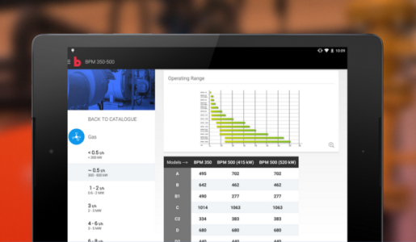

TreeNav
============

This library allows you to display hierarchical information (from a tree data structure) in a vertically scrolling list. You also have the flexibility to define custom layout if you require different type of cells.

===============
**Screenshots**


Usage
--------
In order to use the library, you will need:

1. Using the classes **NAryTree** and **CommandTreeNode** create a tree representation of the information you want to display. 

2. For the your ListView create an instance of the **TreeAdapter**, passing as arguments an instance of a class that extends the **CellListFactory** as well as the dataset you want to use. The TreeAdapter instance provides you access to the items in your data set, and the CellListFactory class creates views for items, and replaces the content of some of the views with new data items when the original item is no longer visible. With those classes you do not need to worry about the typical view holder pattern, just implement certain methods that are invoked when necessary.


Example
--------
The following example uses a ListView as its only layout element. It dynamically creates a tree representation of the information contained in arrays placed in the res folder of the app. For further information about the implementation, please download the sample project.

```dart
public class MainActivity extends Activity {

	private ListView mListView;
	
	TreeAdapter<String> listAdapter;
	
	@Override
	protected void onCreate(Bundle savedInstanceState) {
		super.onCreate(savedInstanceState);
		setContentView(R.layout.activity_main);
		
		mListView = (ListView) findViewById(R.id.list_view);
		
		listAdapter = new TreeAdapter<String>(this, new MenuCellListFactory(), initialiseDataSet(this));
		mListView.setAdapter(listAdapter);
		mListView.setOnItemClickListener(listAdapter);
	}
	
	/**
	 * Creates the initial representation of the data set that will be use for
	 * the ListView.
	 */
	private ArrayList<CommandTreeNode<String>> initialiseDataSet(Context context) {

		NAryTree<String> menuDataSourceTree = getTreeMenu(context);

		ArrayList<CommandTreeNode<String>> listDataSet = new ArrayList<CommandTreeNode<String>>();
		listDataSet.add((CommandTreeNode<String>) menuDataSourceTree.getRoot());

		for (TreeNode<String> mainMenuItemNode : menuDataSourceTree.getRoot().getChildren()) {
			listDataSet.add((CommandTreeNode<String>) mainMenuItemNode);
		}
		
		return listDataSet;
	}
	
	public NAryTree<String> getTreeMenu(final Context context) {
		
		Resources res = context.getResources();

		String[] continents = res.getStringArray(R.array.continents);
		
		CommandTreeNode<String> rootNode = createNode("Continents");
		
		for (final String continent : continents) {
			
			CommandTreeNode<String> continentNode = createNode(continent);
			
			int countriesArrayName = getResources().getIdentifier(formatValue(continent) + "_countries", "array", getPackageName());
			String[] countryList = res.getStringArray(countriesArrayName);
			
			for (final String country : countryList) {
				
				CommandTreeNode<String> countryNode = createNode(country);
				
				int citiesArrayName = res.getIdentifier(formatValue(country) + "_cities", "array", getPackageName());
				String[] cityList = res.getStringArray(citiesArrayName);
				
				for (final String city : cityList) {
					CommandTreeNode<String> cityNode = createNode(city);
					countryNode.addChild(cityNode);
				}
				
				continentNode.addChild(countryNode);
			}
			
			rootNode.addChild(continentNode);
		}
		
		
		NAryTree<String> tree = new NAryTree<String>(rootNode);
		
		return tree;
	}
	
	public CommandTreeNode<String> createNode(final String nodeData) {
		
		CommandTreeNode<String> node = new CommandTreeNode<String>(nodeData);
		node.setCommand(new Command() {
			@Override
			public void executeCommand() {
				Toast.makeText(MainActivity.this, nodeData, Toast.LENGTH_SHORT).show();
			}
		});
		return node;
	}
	
	public String formatValue(String value) {
		return value.toLowerCase(Locale.getDefault()).replace(" ", "_");
	}
	
	@Override
	public void onBackPressed() {
		if (listAdapter.goBackOnNavigationHistory() == false) {
			super.onBackPressed();	
		}
	}
}
```

Download
--------

Download [the latest JAR][1].

Links
--------

- Demo application available on [Google Play](https://play.google.com/store/apps/details?id=be.delhaize)




License
-------

    Copyright(C) 2015 Open Reply

    Licensed under the Apache License, Version 2.0 (the "License");
    you may not use this file except in compliance with the License.
    You may obtain a copy of the License at

       http://www.apache.org/licenses/LICENSE-2.0

    Unless required by applicable law or agreed to in writing, software
    distributed under the License is distributed on an "AS IS" BASIS,
    WITHOUT WARRANTIES OR CONDITIONS OF ANY KIND, either express or implied.
    See the License for the specific language governing permissions and
    limitations under the License.


[1]: https://github.com/dfpalomar/treenav/blob/master/TreeNavLibrary.jar
